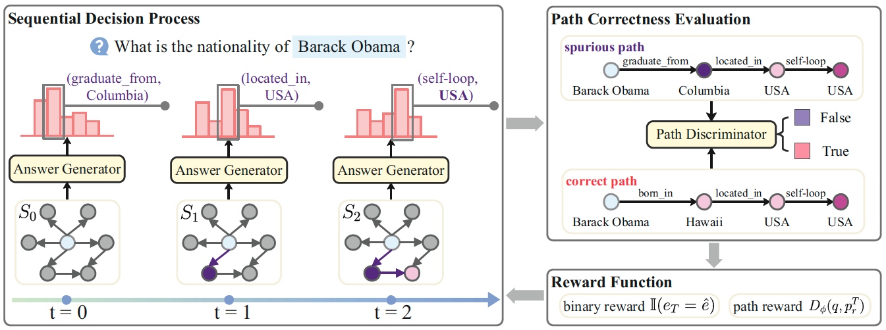

# Adversarial Reinforcement Reasoning Network

Source codes and datasets for the paper "Path-based Multi-hop Reasoning over Knowledge Graph for Answering Questions via Adversarial Reinforcement Learning".

The architectures of the answer generator and path discriminator are as follows:


The overall procedure of AR2N is as follow:



## Train

```
cd /Codes/GAN
python main.py --train --dataset=<dataset>
```

`dataset` is the name of datasets. In our experiments, `dataset` could be `PQ-2H`, `PQ-3H`, `PQ-mix`, `PQL-2H`, `PQL-3H`, `PQL-mix`, `MetaQA-1H`, `MetaQA-2H`, `MetaQA-3H` or `MetaQA-mix`.

## Test

```
cd /Codes/GAN
python main.py --eval --dataset=<dataset>
```
